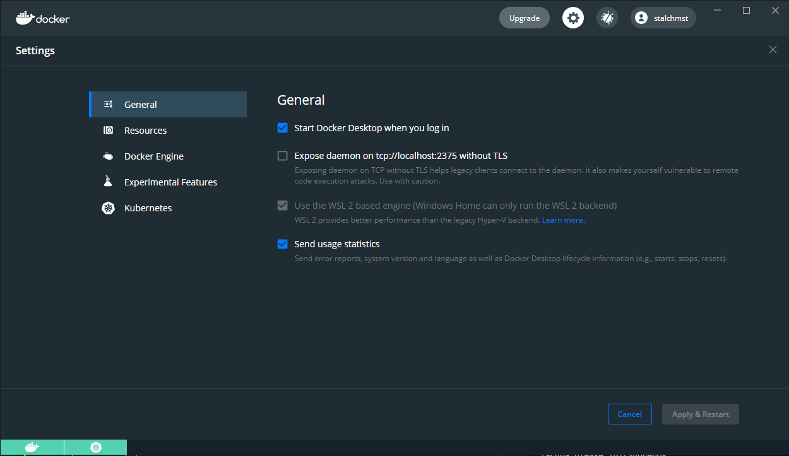
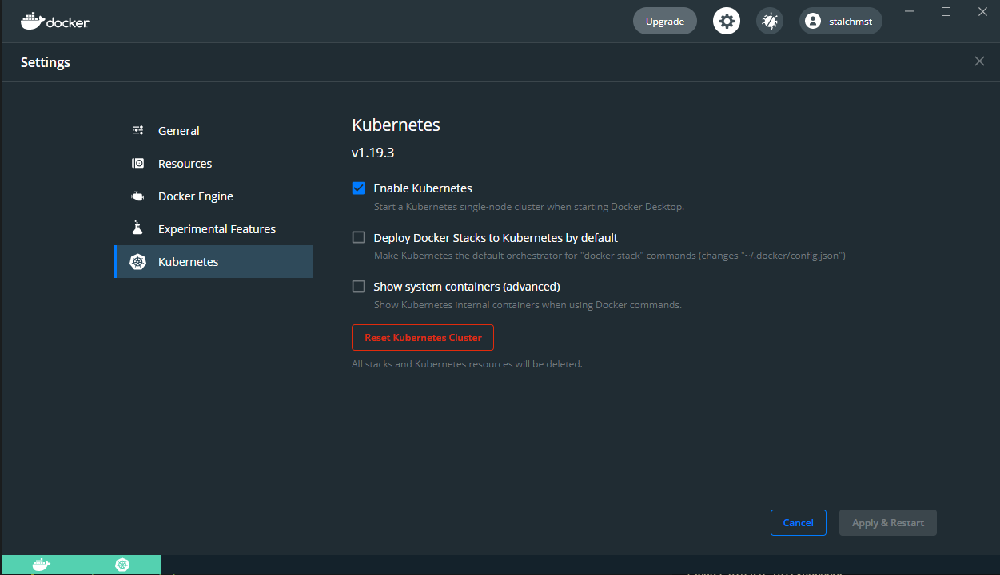
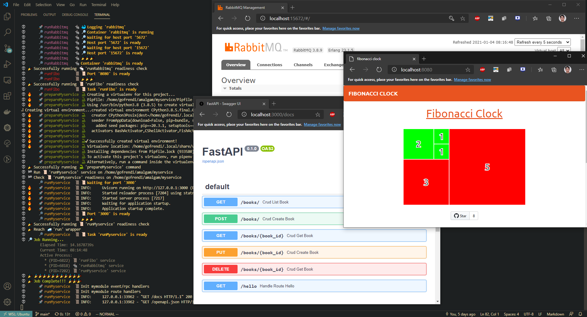

# Amalgam

In this tutorial, we will explore how Zaruba might help you to:

* Create monorepo
* Clone existing project into your monorepo
* Create messagebus-ready CRUD Fastapi service
* Create tasks to run docker/services
* Run tasks

> 💀 __Amalgam:__ _​[countable, usually singular]_ amalgam (of something) (formal) a mixture or combination of things

# Getting Started

We will go into the detail later. For now, you probably just want to see what zaruba can do.

## Install go and git

Installing Zaruba is basically cloning it's repository and perform compilation.  In order to do that, you need `git` and `golang` to be installed in your computer.

```sh
sudo apt-get install git golang
```

## Install Zaruba

```sh
sh -c "$(curl -fsSL https://raw.githubusercontent.com/state-alchemists/zaruba/master/install.sh)"
```

The installation script will clone zaruba's repository to your `~/.zaruba` and perform compilation.  It will also try to create symlink to `/usr/bin/zaruba` (that's why it needs root access).

You are encouraged to have a look at [the installation script](https://raw.githubusercontent.com/state-alchemists/zaruba/master/install.sh) in order to know see what really going on.

## Update Zaruba

This tutorial was tested by using `zaruba v0.5.8`. To show your current zaruba version, you can invoke `zaruba please showVersion`

```sh
zaruba please update
```

## Setting up docker and kubernetes in your local computer

If you are using windows, the easiest way to get started with docker and kubernetes is by installing WSL2 and docker-desktop. 

You can then enable WSL2 backend (that will be the only option available for windows home). 




You can also enable kubernetes as well.

> 📝 __Note:__ You probably don't need to enable kubernetes if you just want to run your services locally.



If you have EKS/GKE/AKS, and you don't want to run kubernetes locally, you can skip this step.


## Rock on

> 💡 __TIPS:__ Some commands required keyword argument, and the keyword might seem overwhelming. Unless you want to automate things (i.e: building CI/CD), you probably want to run the commands interactively. For example, you can run `zaruba please makeFastModule --interactive` instead of `zaruba please makeFastModule generator.service.location=myservice generator.module.name=mymodule`

This tutorial assume you use ubuntu 20.04, either as your main OS or from inside WSL.
Now let's try to run the commands.

```sh
#!/bin/sh
set -e
sudo rm -Rf myproject

# Setup ubuntu
sudo -E zaruba please setupUbuntu
zaruba please setupPyenv

# Initialize project
mkdir -p myproject
cd myproject
zaruba please initProject

# Import external repo
zaruba please addSubrepo subrepo.url="https://github.com/state-alchemists/fibonacci-clock" subrepo.prefix="fibo"
zaruba please initSubrepos
zaruba please pullSubrepos

# Create FastAPI Service
zaruba please makeFastService generator.service.location=myservice
# Create module
zaruba please makeFastModule generator.service.location=myservice generator.module.name=mymodule
# Create custom route (optional)
zaruba please makeFastRoute generator.service.location=myservice generator.module.name=mymodule generator.url=/hello
# Create event/RPC handler (optional)
zaruba please makeFastEventHandler generator.service.location=myservice generator.module.name=mymodule generator.event.name=myEvent
zaruba please makeFastRPCHandler generator.service.location=myservice generator.module.name=mymodule generator.event.name=myRPC
# Create CRUD
zaruba please makeFastCRUD generator.service.location=myservice generator.module.name=mymodule generator.crud.entity=book generator.crud.fields=title,author,synopsis

# Create Service Task
zaruba please makeServiceTask generator.service.location=fibo
zaruba please makeServiceTask generator.service.location=myservice generator.service.type=fastapi

# Create Docker Task
zaruba please makeDockerTask generator.docker.image.name=rabbitmq

# Run services
zaruba please run

# Or run services as container (press ctrl + c first)
zaruba please runContainer
zaruba please removeContainer

# ==== Stop here if you don't want to deploy on kubernetes ====

# Setup kubernentes client
zaruba please setupKubeClient

# Push images
zaruba please setProjectValue variable.name=dockerImagePrefix::default variable.value=stalchmst
zaruba please pushImage

# Make helm charts
zaruba please makeHelmCharts

# Create helm deployment values
zaruba please makeServiceDeployment generator.service.location=fibo
zaruba please makeServiceDeployment generator.service.location=myservice

# Update environment
zaruba please updateEnv

# Helm apply
zaruba please helmApply kube.context=docker-desktop

# Helm destroy
zaruba please helmDestroy kube.context=docker-desktop
```

Now you have see `rabbitmq`, `fibo`, and `myservice` running (either as stand alone applications, docker containers, or even on kubernetes).



This repo contains all generated tasks, so you can have a look and see what's going on.

# Let's see things in detail

## Setup Ubuntu

```sh
sudo -E zaruba please setupUbuntu
zaruba please setupPyenv
```

Those two commands will install some software to your ubuntu machine, as well as pyenv. Pyenv is a simple python-version-management. Some tasks in Zaruba were written in Python, and pyenv is a good way to get started with python.

## Initialize Project

A Zaruba project is basically a git repository. The project should at least have `main.zaruba.yaml`.

The following commands will make a project in `myproject` directory:

```sh
mkdir -p myproject
cd myproject
zaruba please initProject
```

## Zaruba's script

You might already familiar with terraform's HCL, gitlab-ci, or github action. Don't worry if you are not. Those seemingly alien scripts are used to define tasks for automation. Most of those script (except for terraform's HCL) are written in YAML. YAML is like JSON, but it use indentation instead of curly-braces.

Zaruba's script are simply a YAML to define your tasks.

Although you don't need to worry about the script since zaruba can also generate the script for you, it is always better to know what's going on.

Zaruba tasks usually contains 3 keys: `includes`, `inputs` and `tasks`:

```yaml
includes:

- ${ZARUBA_HOME}/scripts/core.zaruba.yaml
- ./zaruba-tasks/runRabbitmq.zaruba.yaml

inputs:

  withApple:
    default: no    
    description: also show apple

tasks:

  run:
    icon: 🚅
    description: Run everything at once
    extend: core.runShellScript
    dependencies:
    - runFibo
    - runRabbitmq
    inputs:
    - withApple
    config:
      start: |
        {{ if eq (.GetValue "withApple") "true" }}
          echo "🍎"
        {{ end }}

  runFibo:
    icon: 📜
    description: Run fibo
    extend: serveHttp
    location: fibo
    env: &fiboEnv
      HTTP_PORT:
        from: FIBO_HTTP_PORT
        default: 8080
    lconfig:
      ports: &fiboPorts
      - '{{ .GetEnv "HTTP_PORT" }}'
    config: {}

```

### includes

This section is pretty straight forward. You can include as many other zaruba script as you need. Several useful scripts are available under `${ZARUBA_HOME}/scripts/core.zaruba.yaml`, so you might want to include it on every zaruba script you create.

### inputs

This section contains possible input for all zaruba tasks. Some tasks might share the same inputs. For example, creating docker container and removing docker container both require `docker.containerName`.

An input might has `default` value and `description`.

### tasks

This section contains task definition. A task might extend or depend on other tasks.

In our example, `runFibo` extend `serveHttp`. It means that `runFibo` is basically `serveHttp` with several configuration overridden.

On the other hand, `run` not only extend `core.runShellScript`, but also depends on `runFibo` and `runRabbitmq`. It means that whenever `run` is executed, `runFibo` and `runRabbitmq` will be executed first.

To execute tasks you can invoke:

```sh
zaruba please <task-names>
# or
zaruba please <task-names> --interactive
```

> 💡 __TIPS:__ Execute task with `--interactive` flag is probably a good idea if you don't want to remember all the inputs.

## Import External Repo

```sh
zaruba please addSubrepo subrepo.url="https://github.com/state-alchemists/fibonacci-clock" subrepo.prefix="fibo"
zaruba please initSubrepos
zaruba please pullSubrepos
```

Suppose you already have some separated repositories, you can merge them into your monorepo by using git subtree.

You can use `zaruba please addSubrepo` to add sub-repository to your project. Once the sub-repositories added, you can then perform `zaruba please initSubrepos`.

## Create FastAPI Service

```sh
zaruba please makeFastService generator.service.location=myservice
```

This will create FastAPI service in `myservice` directory.  

## Create FastAPI Module

```sh
zaruba please makeFastModule generator.service.location=myservice generator.module.name=mymodule
```

A service might have several modules. You can make a FastAPI module in you newly created FastAPI service by executing `makeFastModule` command.

You can also make URL/event handler by using these commands respectively:

```sh
# Create custom route (optional)
zaruba please makeFastRoute generator.service.location=myservice generator.module.name=mymodule generator.url=/hello
# Create event/RPC handler (optional)
zaruba please makeFastEventHandler generator.service.location=myservice generator.module.name=mymodule generator.event.name=myEvent
```

## Create FastAPI CRUD

Beside creating URL/event handler, you can also create CRUD handler by invoking this command:

```sh
zaruba please makeFastCRUD generator.service.location=myservice generator.module.name=mymodule generator.crud.entity=book generator.crud.fields=title,author,synopsis
```

## Create Service Task

Remember our `fibo` subrepo? To actually run it along with `myservice`, you need to generate service tasks as follow:

```sh
zaruba please makeServiceTask generator.service.location=fibo
zaruba please makeServiceTask generator.service.location=myservice generator.service.type=fastapi
```

## Create Docker Task

Similar to service task, you can also make docker task in case of you want to run third party container

```sh
zaruba please makeDockerTask generator.docker.image.name=rabbitmq
```

## Run Services

To run all sevices, you can simply invoke

```sh
zaruba please run
```

If you go into detail, you will see that `run` task is depends on `runFibo`, `runMyservice` and `runRabbitmq`.

```sh
includes:
- ${ZARUBA_HOME}/scripts/core.zaruba.yaml
- ./zaruba-tasks/runFibo.zaruba.yaml
- ./zaruba-tasks/runMyservice.zaruba.yaml
- ./zaruba-tasks/runRabbitmq.zaruba.yaml
tasks:
  run:
    icon: 🚅
    description: Run everything at once
    dependencies:
    - runFibo
    - runMyservice
    - runRabbitmq
```


## Run Services as Containers

```
zaruba please runContainer
```

## Setup Kubernentes Client

```sh
zaruba please setupKubeClient
```

## Push Images

```sh
zaruba please setProjectValue variable.name=dockerImagePrefix::default variable.value=stalchmst
zaruba please pushImage
```

## Create Helm Charts

```sh
zaruba please makeHelmCharts
```

## Create Helm Deployment Values

```sh
zaruba please makeServiceDeployment generator.service.location=fibo
zaruba please makeServiceDeployment generator.service.location=myservice
```

## Deploy Helm

```sh
zaruba please helmApply kube.context=docker-desktop
```