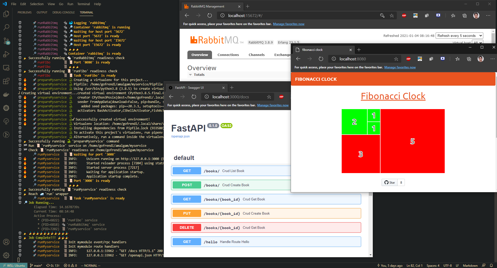

# Amalgam

In this tutorial, we will explore how Zaruba might help you to:

* Create monorepo
* Clone existing project into your monorepo
* Create messagebus-ready CRUD Fastapi service
* Create tasks to run docker/services
* Run tasks

> 💀 __Amalgam:__ _​[countable, usually singular]_ amalgam (of something) (formal) a mixture or combination of things

# How it looks like

## Install go and git

Installing Zaruba is basically cloning it's repository and perform compilation.  In order to do that, you need `git` and `golang` to be installed in your computer.

```sh
sudo apt-get install git golang
```

## Install Zaruba

```sh
sh -c "$(curl -fsSL https://raw.githubusercontent.com/state-alchemists/zaruba/master/install.sh)"
```

The installation script will clone zaruba's repository to your `~/.zaruba` and perform compilation.  It will also try to create symlink to `/usr/bin/zaruba` (that's why it needs root access).

You are encouraged to have a look at [the installation script](https://raw.githubusercontent.com/state-alchemists/zaruba/master/install.sh) in order to know see what really going on.

## Update Zaruba

This tutorial was tested by using `zaruba v0.2.0`. To show your current zaruba version, you can invoke `zaruba please showVersion`

```sh
zaruba please update
```

## Getting your machine ready

Currently zaruba only support ubuntu, for other operating system, you can install: `docker`, `python`, `pipenv`, and `netcat`.

```sh
sudo -E zaruba please setupUbuntu
zaruba please setup pyEnv
```

## Rock on

Now let's try to run the commands.

```sh
mkdir amalgam
cd amalgam

# Initiating monorepo project
zaruba please initProject

# Set and clone existing project to your monorepo
zaruba please addSubrepo url="https://github.com/state-alchemists/fibonacci-clock" prefix="fibo"
zaruba please initSubrepos
zaruba please pullSubrepos

# Create FastAPI Service
zaruba please makeFastService location=myservice
# Create module
zaruba please makeFastModule location=myservice module=mymodule
# Create custom route (optional)
zaruba please makeFastRoute location=myservice module=mymodule url=/hello
# Create event/RPC handler (optional)
zaruba please makeFastEventHandler location=myservice module=mymodule event=myEvent
zaruba please makeFastRPCHandler location=myservice module=mymodule event=myRPC
# Create CRUD
zaruba please makeFastCRUD location=myservice module=mymodule entity=book fields=title,author,synopsis

# Create Docker Task
zaruba please makeDockerTask image=rabbitmq

# Create Service Task
zaruba please makeServiceTask location=fibo

# Run services
zaruba please run
# Or run services as container (press ctrl + c first)
zaruba please runContainer
zaruba please removeContainer
# And push our images
# zaruba please setKwarg key=dockerRepo value=stalchmst
# zaruba please pushImage
```

Now you should have `rabbitmq`, `fibo`, and `myservice` running. All at once, just like [the three prime evils](https://diablo.fandom.com/wiki/Prime_Evil#The_Three_Brothers).



This repo contains all generated tasks, so you can have a look and see what's going on.

> TODO: provide explanation for every command